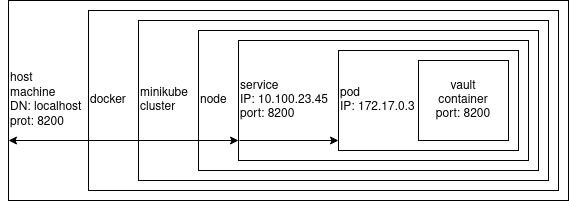

University: [ITMO University](https://itmo.ru/ru/)

Faculty: [FICT](https://fict.itmo.ru)

Course: [Introduction to distributed technologies](https://github.com/itmo-ict-faculty/introduction-to-distributed-technologies)

Year: Fedotov Petr Sergeevich

Lab: Lab1

Date of create: 20.10.2022

Date of finished: 

# Progress of work

## Preparing 

### [Uninstall old version of Docker](https://docs.docker.com/engine/install/ubuntu/#uninstall-old-versions)

```sh
$ sudo apt-get remove docker docker-engine docker.io containerd runc
[sudo] password for peter: 
Reading package lists... Done
Building dependency tree       
Reading state information... Done
E: Unable to locate package docker-engine
```

### [Install Docker Engine on Ubuntu](https://docs.docker.com/engine/install/ubuntu/)

* Set up the repository

1. Update the apt package index and install packages to allow apt to use a repository over HTTPS:

   ```sh
   sudo apt-get update
   sudo apt-get install \
       ca-certificates \
       curl \
       gnupg \
       lsb-release
   ```

2. Add Docker’s official GPG key:

   ```sh
   sudo mkdir -p /etc/apt/keyrings
   curl -fsSL https://download.docker.com/linux/ubuntu/gpg | sudo gpg --dearmor -o /etc/apt/keyrings/docker.gpg
   ```

3. Use the following command to set up the repository:

   ```sh
   echo \
     "deb [arch=$(dpkg --print-architecture) signed-by=/etc/apt/keyrings/docker.gpg] https://download.docker.com/linux/ubuntu \
     $(lsb_release -cs) stable" | sudo tee /etc/apt/sources.list.d/docker.list > /dev/null
   ```

4. Use the following command to set up the repository

   ```sh
   echo \
     "deb [arch=$(dpkg --print-architecture) signed-by=/etc/apt/keyrings/docker.gpg] https://download.docker.com/linux/ubuntu \
     $(lsb_release -cs) stable" | sudo tee /etc/apt/sources.list.d/docker.list > /dev/null```
   ```

5. Update the apt package index

   ```sh
   sudo apt-get update
   ```

6. Install Docker Engine, containerd, and Docker Compose.

   ```sh
   sudo apt-get install docker-ce docker-ce-cli containerd.io docker-compose-plugin
   ```

7. Verify that the Docker Engine installation is successful by running the hello-world image

   ```sh
   $ sudo docker run hello-world
   Unable to find image 'hello-world:latest' locally
   latest: Pulling from library/hello-world
   2db29710123e: Pull complete 
   Digest: sha256:faa03e786c97f07ef34423fccceeec2398ec8a5759259f94d99078f264e9d7af
   Status: Downloaded newer image for hello-world:latest
   
   Hello from Docker!
   This message shows that your installation appears to be working correctly.
   
   To generate this message, Docker took the following steps:
    1. The Docker client contacted the Docker daemon.
    2. The Docker daemon pulled the "hello-world" image from the Docker Hub.
       (amd64)
    3. The Docker daemon created a new container from that image which runs the
       executable that produces the output you are currently reading.
    4. The Docker daemon streamed that output to the Docker client, which sent it
       to your terminal.
   
   To try something more ambitious, you can run an Ubuntu container with:
    $ docker run -it ubuntu bash
   
   Share images, automate workflows, and more with a free Docker ID:
    https://hub.docker.com/
   
   For more examples and ideas, visit:
    https://docs.docker.com/get-started/
   
   ```

8. [Post install](https://docs.docker.com/engine/install/linux-postinstall/):

   ```
   sudo groupadd docker           # Create the docker group
   sudo usermod -aG docker $USER  # Add your user to the docker group
   newgrp docker                  # activate the changes to groups
   docker run hello-world         # Works successful
   ```

### Install [Minikube](https://minikube.sigs.k8s.io/docs/start/)

```sh
curl -LO https://storage.googleapis.com/minikube/releases/latest/minikube_latest_amd64.deb
sudo dpkg -i minikube_latest_amd64.deb
```

## Main part

### Try to start Minikube

```sh
$ minikube start
😄  minikube v1.28.0 on Ubuntu 20.04
✨  Automatically selected the docker driver. Other choices: none, ssh, qemu2 (experimentl)
📌  Using Docker driver with root privileges
👍  Starting control plane node minikube in cluster minikube
🚜  Pulling base image ...
💾  Downloading Kubernetes v1.25.3 preload ...
    > gcr.io/k8s-minikube/kicbase:  386.27 MiB / 386.27 MiB  100.00% 675.35 KiB
    > preloaded-images-k8s-v18-v1...:  334.47 MiB / 385.44 MiB  86.78% 1.76 MiB⌛  Anothe    > preloaded-images-k8s-v18-v1...:  385.44 MiB / 385.44 MiB  100.00% 548.36 
    > gcr.io/k8s-minikube/kicbase:  0 B [_______________________] ?% ? p/s 4m1s

🔥  Creating docker container (CPUs=2, Memory=2200MB) ...
🐳  Preparing Kubernetes v1.25.3 on Docker 20.10.20 ...
    ▪ Generating certificates and keys ...
    ▪ Booting up control plane ...
    ▪ Configuring RBAC rules ...
🔎  Verifying Kubernetes components...
    ▪ Using image gcr.io/k8s-minikube/storage-provisioner:v5
🌟  Enabled addons: default-storageclass
💡  kubectl not found. If you need it, try: 'minikube kubectl -- get pods -A'
🏄  Done! kubectl is now configured to use "minikube" cluster and "default" namespace by default
```

### Pull docker image

```sh
$ docker pull vault                                                
Using default tag: latest
latest: Pulling from library/vault
c7ed990a2339: Pull complete 
b4ad38e6b2db: Pull complete 
b917f7845ac1: Pull complete 
c8aa5f2114bc: Pull complete 
13ccbbaf37ef: Pull complete 
Digest: sha256:08dd1cb922624c51a5aefd4d9ce0ac5ed9688d96d8a5ad94664fa10e84702ed6
Status: Downloaded newer image for vault:latest
docker.io/library/vault:latest
```

### Write and run [manifest](./pods/simple-pod.yaml)

After errors:

Error: no label

```sh
$ kubectl expose pod vault --type=NodePort --port=8200
error: couldn't retrieve selectors via --selector flag or introspection: the pod has no labels and cannot be exposed
```

The manifest (configuration file) was written.

```yaml
apiVersion: v1
kind: Pod
metadata:
  name: vault
  labels: 
    app: vault
spec:
  containers:
  - name: vault
    image: vault:latest
    ports:
    - containerPort: 8200
```

Apply manifest

```sh
$ kubectl apply -f simple-pod.yaml                                 
pod/vault created
```

Get pods from Minicube

```
$ kubectl get pods                                                 
NAME    READY   STATUS    RESTARTS   AGE
vault   1/1     Running   0          4m38s
```

### Create service and port forwarding

```sh
$ kubectl expose pod vault --type=NodePort --port=8200             
service/vault exposed
```

```sh
$ kubectl port-forward service/vault 8200:8200
Forwarding from 127.0.0.1:8200 -> 8200
Forwarding from [::1]:8200 -> 8200
```

### Get Root token from pod's logs

```sh
$ kubectl logs vault | tail
    $ export VAULT_ADDR='http://0.0.0.0:8200'

The unseal key and root token are displayed below in case you want to
seal/unseal the Vault or re-authenticate.

Unseal Key: raq7DJ7CzexznjZ0IYD2QPVuc9Xn0oLOLTRyU+UTgSw=
Root Token: hvs.rSlHU4jt8BvNuMFQe2EZVIbI

Development mode should NOT be used in production installations!
```

### Login to Vault


### The Minicube was stopped

```sh
$ minikube stop
✋  Stopping node "minikube"  ...
🛑  Powering off "minikube" via SSH ...
🛑  1 node stopped.
```

```sh
$ docker ps
CONTAINER ID   IMAGE     COMMAND   CREATED   STATUS    PORTS     NAMES
```

## The scheme


