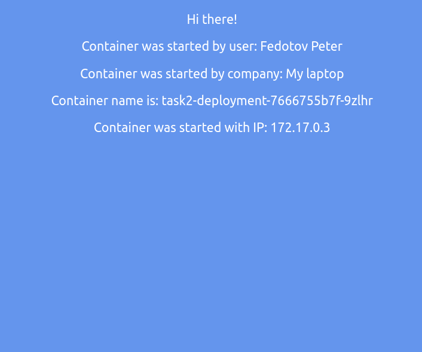
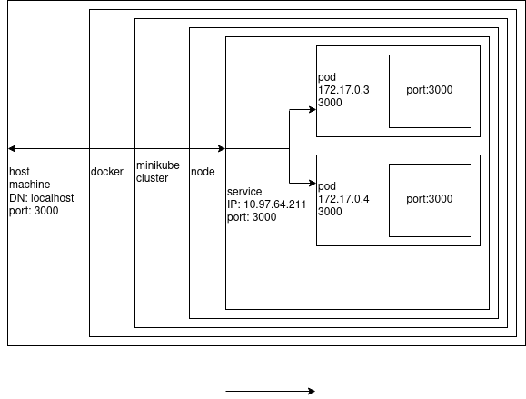

University: [ITMO University](https://itmo.ru/ru/)

Faculty: [FICT](https://fict.itmo.ru)

Course: [Introduction to distributed technologies](https://github.com/itmo-ict-faculty/introduction-to-distributed-technologies)

Year: Fedotov Petr Sergeevich

Lab: Lab2

Date of create: 

Date of finished: 


## Write deployment, and service

```yaml
apiVersion: apps/v1
kind: Deployment
metadata:
  name: task2-deployment
  labels:
    app: task2
spec:
  replicas: 2
  selector:
    matchLabels:
      app: task2
  template:
    metadata:
      labels:
        app: task2
    spec:
      containers:
      - name: task2
        image: ifilyaninitmo/itdt-contained-frontend:master
        ports:
        - containerPort: 3000
        env:
        - name: REACT_APP_USERNAME
          value: Fedotov Peter
        - name: REACT_APP_COMPANY_NAME
          value: My laptop
```

```yaml
apiVersion: v1
kind: Service
metadata:
  name: my-service
spec:
  selector:
    app: task2
  ports:
    - protocol: TCP
      port: 3000
      targetPort: 3000
```

## Apply deployment and service

```
$ kubectl apply -f deployment.yaml                              
deployment.apps/task2-deployment created
```

```
$ kubectl get pods,rc,service,deployment
NAME                                    READY   STATUS              RESTARTS   AGE
pod/task2-deployment-7666755b7f-9zlhr   0/1     ContainerCreating   0          2m16s
pod/task2-deployment-7666755b7f-xwgk8   0/1     ErrImagePull        0          2m16s

NAME                 TYPE        CLUSTER-IP   EXTERNAL-IP   PORT(S)   AGE
service/kubernetes   ClusterIP   10.96.0.1    <none>        443/TCP   2d18h

NAME                               READY   UP-TO-DATE   AVAILABLE   AGE
deployment.apps/task2-deployment   0/2     2            0           2m17s
```

```
kubectl get pods,service,deployment                           
NAME                                    READY   STATUS    RESTARTS   AGE
pod/task2-deployment-7666755b7f-9zlhr   1/1     Running   0          17m
pod/task2-deployment-7666755b7f-xwgk8   1/1     Running   0          17m

NAME                 TYPE        CLUSTER-IP   EXTERNAL-IP   PORT(S)   AGE
service/kubernetes   ClusterIP   10.96.0.1    <none>        443/TCP   2d18h

NAME                               READY   UP-TO-DATE   AVAILABLE   AGE
deployment.apps/task2-deployment   2/2     2            2           17m
```

```
$ kubectl apply -f service.yaml
$ kubectl describe service/my-service                       
Name:              my-service
Namespace:         default
Labels:            <none>
Annotations:       <none>
Selector:          app=task2
Type:              ClusterIP
IP Family Policy:  SingleStack
IP Families:       IPv4
IP:                10.97.64.211
IPs:               10.97.64.211
Port:              <unset>  3000/TCP
TargetPort:        3000/TCP
Endpoints:         172.17.0.3:3000,172.17.0.4:3000 <----- Balancing
Session Affinity:  None
Events:            <none>
```

## Logs of Pods

```
$ kubectl get pods                                              
NAME                                READY   STATUS    RESTARTS   AGE                      
task2-deployment-7666755b7f-9zlhr   1/1     Running   0          30m                      
task2-deployment-7666755b7f-xwgk8   1/1     Running   0          30m

$ kubectl logs task2-deployment-7666755b7f-9zlhr
Builing frontend                                                                          
build finished                                                                            
Server started on port 3000    


$ kubectl logs task2-deployment-7666755b7f-xwgk8
Builing frontend                                                                          
build finished                                                                            
Server started on port 3000  
```

## UI



## Scheme



---------------

Questions:

* What is Controller:  
   A control loop that watches the shared state of the cluster through the apiserver and makes changes attempting to move the current state towards the desired state.