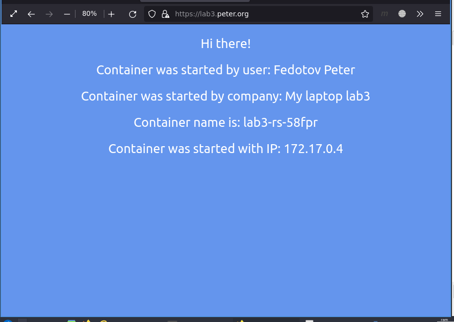
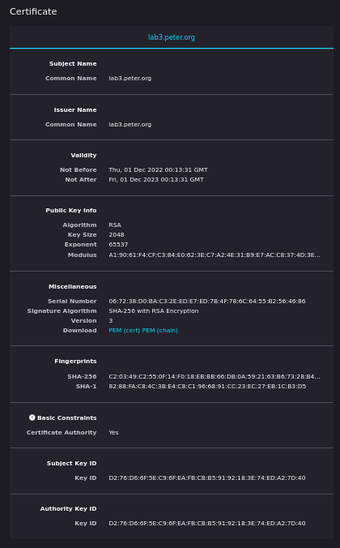
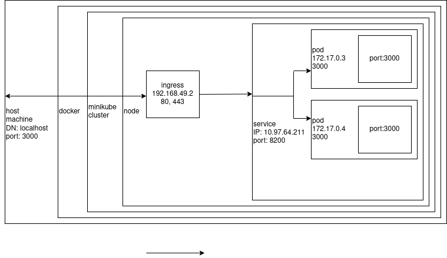

University: [ITMO University](https://itmo.ru/ru/)

Faculty: [FICT](https://fict.itmo.ru)

Course: [Introduction to distributed technologies](https://github.com/itmo-ict-faculty/introduction-to-distributed-technologies)

Year: Fedotov Petr Sergeevich

Lab: Lab3

Date of create: 01.11.2022

Date of finished: 

# Progress of work

## Create `configMap`

The content of `configmap.yaml`

```yaml
apiVersion: v1
kind: ConfigMap
metadata:
  name: lab3-config-map
data:
  # property-like keys; each key maps to a simple value
  REACT_APP_USERNAME: "Fedotov Peter"
  REACT_APP_COMPANY_NAME: "My laptop lab3"
```

## Create `replicaSet`

The content of `replicaset.yaml`

```yaml
apiVersion: apps/v1
kind: ReplicaSet
metadata:
  name: lab3-rs
  labels:
    app: lab3
spec:
  replicas: 2
  selector:
    matchLabels:
      app: lab3
  template:
    metadata:
      labels:
        app: lab3
    spec:
      containers:
      - name: lab3-containers
        image: ifilyaninitmo/itdt-contained-frontend:master
        ports:
        - containerPort: 3000
        env:
          - name: REACT_APP_USERNAME
            valueFrom:
              configMapKeyRef:
                name: lab3-config-map
                key: REACT_APP_USERNAME
          - name: REACT_APP_COMPANY_NAME 
            valueFrom:
              configMapKeyRef:
                name: lab3-config-map
                key: REACT_APP_COMPANY_NAME
```

## Create `service`

The content of `service.yaml`

```yaml
apiVersion: v1
kind: Service
metadata:
  name: lab3-service
spec:
  selector:
    app: lab3
  ports:
    - protocol: TCP
      port: 8200
      targetPort: 3000
```

## Create ingress

The content of `ingress.yaml`

```yaml
apiVersion: networking.k8s.io/v1
kind: Ingress
metadata:
  name: ingress-lab3
spec:
  rules:
    - host: lab3.peter.org
      http:
        paths:
          - path: /
            pathType: Prefix
            backend:
              service:
                name: lab3-service
                port:
                  number: 8200
  tls:
    - hosts:
        - lab3.peter.org 
      secretName: tls-secret
```

## Test with no cert

### Apply `configMap`, `replicaSet`, `service`

```sh
$ kubectl apply -f configmap.yaml
$ kubectl apply -f replicaset.yaml  
$ kubectl apply -f service.yaml 
```

### Port-forwarding

```sh
$ kubectl port-forward service/lab3-service 8200:3000
Forwarding from 127.0.0.1:8200 -> 3000
Forwarding from [::1]:8200 -> 3000
Handling connection for 8200
Handling connection for 8200
```

### Result


## Generate and import of the TLS certificate to `minikube`

Generating of tls:

```sh
$ openssl genrsa -out ca.key 2048
Generating RSA private key, 2048 bit long modulus (2 primes)
.......................+++++
..............................................................................................................................................................+++++
e is 65537 (0x010001)

$ openssl req -x509 -new -nodes -days 365 -key ca.key -out ca.crt -subj "/CN=lab3.peter.org"

$ ls ca*
ca.crt  ca.key
```

Enabling ingress addons:

```sh
$ minikube addons enable ingress
💡  ingress is an addon maintained by Kubernetes. For any concerns contact minikube on GitHub.
You can view the list of minikube maintainers at: https://github.com/kubernetes/minikube/blob/master/OWNERS
    ▪ Using image k8s.gcr.io/ingress-nginx/controller:v1.2.1
    ▪ Using image k8s.gcr.io/ingress-nginx/kube-webhook-certgen:v1.1.1
    ▪ Using image k8s.gcr.io/ingress-nginx/kube-webhook-certgen:v1.1.1
🔎  Verifying ingress addon...
🌟  The 'ingress' addon is enabled

$ minikube addons enable ingress-dns
💡  ingress-dns is an addon maintained by Google. For any concerns contact minikube on GitHub.
You can view the list of minikube maintainers at: https://github.com/kubernetes/minikube/blob/master/OWNERS
    ▪ Using image gcr.io/k8s-minikube/minikube-ingress-dns:0.0.2
🌟  The 'ingress-dns' addon is enabled
```

Importing of the certivicate to `minikube`

```sh
$ kubectl create secret tls tls-secret --cert=ca.crt --key=ca.key
secret/tls-secret created
```

## Editing `hosts`

This line was added to the `/etc/hosts` file.

```
# Distr lab 3
192.168.49.2 lab3.peter.org
```

## Checking of the certificate

```sh
$ kubectl apply -f replicaset.yaml 
replicaset.apps/lab3-rs created
peter@lubuntu-laptop:~/ITMO/Master/1_year/1_sem/Introduction_to_distribution_systems/Labs_docker_m8k/github/lab3$ kubectl apply -f service.yaml 
service/lab3-service created
peter@lubuntu-laptop:~/ITMO/Master/1_year/1_sem/Introduction_to_distribution_systems/Labs_docker_m8k/github/lab3$ kubectl apply -f ingress.yaml 
ingress.networking.k8s.io/ingress-lab3 created
```

# Results

Representation of running k8s objects.

```
$ kubectl get configmap,replicaset,service,ingress,secret
NAME                         DATA   AGE
configmap/kube-root-ca.crt   1      14d
configmap/lab3-config-map    2      2m11s

NAME                      DESIRED   CURRENT   READY   AGE
replicaset.apps/lab3-rs   2         2         2       2m6s

NAME                   TYPE        CLUSTER-IP      EXTERNAL-IP   PORT(S)    AGE
service/kubernetes     ClusterIP   10.96.0.1       <none>        443/TCP    14d
service/lab3-service   ClusterIP   10.109.243.56   <none>        8200/TCP   2m1s

NAME                                     CLASS   HOSTS            ADDRESS        PORTS     AGE
ingress.networking.k8s.io/ingress-lab3   nginx   lab3.peter.org   192.168.49.2   80, 443   116s

NAME                TYPE                DATA   AGE
secret/tls-secret   kubernetes.io/tls   2      2m31s
```

Viewing the app in web browser:



Viewing the certificate from Firefox:



## Files

List directory:

```
$ l
ca.crt
ca.key
configmap.yaml
Img/
ingress.yaml
ingress.yaml.bak
lab3_report.md
Other/
replicaset.yaml
service.yaml
```

[configmap.yaml](./configmap.yaml)

[ingress.yaml](./ingress.yaml)

[replicaset.yaml](./replicaset.yaml)

[service.yaml](./service.yaml)

## Scheme



# Terms:

**CONFIGMAP**

[`configMap`](https://kubernetes.io/docs/concepts/configuration/configmap/) - 
A ConfigMap is an API object used to store non-confidential data in key-value pairs. [Pods](https://kubernetes.io/docs/concepts/workloads/pods/) can consume ConfigMaps as environment variables, command-line arguments, or as configuration files in a [volume](https://kubernetes.io/docs/concepts/storage/volumes/).

> Use a ConfigMap for setting configuration data separately from application code.

> The data stored in a ConfigMap cannot exceed 1 MiB.

> The name of a ConfigMap must be a valid DNS subdomain name.

**REPLICASET**

[`replicaSet`](https://kubernetes.io/docs/concepts/workloads/controllers/replicaset/)

**INGRESS**

[`ingress`](https://kubernetes.io/docs/concepts/services-networking/ingress/) in minikube

An API object that manages external access to the services in a cluster, typically HTTP.

Ingress may provide load balancing, SSL termination and name-based virtual hosting.


**THE DIFFERENCE BETWEEN DEPLOYMENT AND REPLICASET**

difference between `deployment` and `replicaSet`: A Deployment provides declarative updates for Pods and ReplicaSets.

> A ReplicaSet ensures that a specified number of pod replicas are running at any given time. However, a Deployment is a higher-level concept that manages ReplicaSets and provides declarative updates to Pods along with a lot of other useful features. Therefore, we recommend using Deployments instead of directly using ReplicaSets, unless you require custom update orchestration or don't require updates at all.
