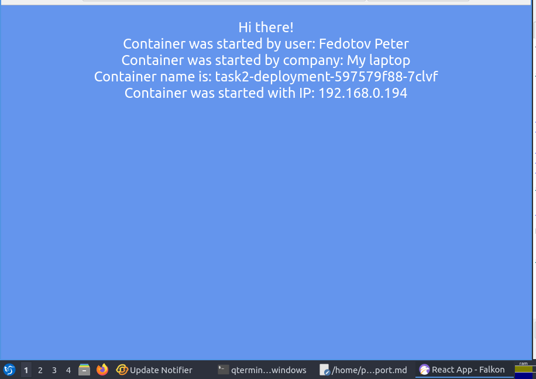
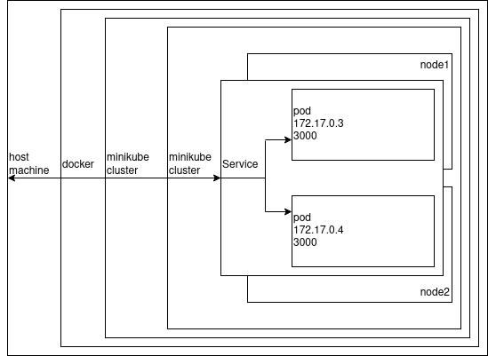

University: [ITMO University](https://itmo.ru/ru/)

Faculty: [FICT](https://fict.itmo.ru)

Course: [Introduction to distributed technologies](https://github.com/itmo-ict-faculty/introduction-to-distributed-technologies)

Year: Fedotov Petr Sergeevich

Lab: Lab4

Date of create: 08.11.2022

Date of finished: 

# Lab4 "Communication networks in Minicube, CNI and Core DNS"

## Planning

### Start `minicube` correctly

* Install plugin `CNI=calico`.

   [Install Calico to Minikube](https://projectcalico.docs.tigera.io/getting-started/kubernetes/minikube)

* Set `Multi-Node Clusters` mode at the same time.
   [Turning of 2 nodes](https://minikube.sigs.k8s.io/docs/tutorials/multi_node/)

```
minikube start --network-plugin=cni --cni=calico --nodes 2
```

### Checking CNI Calico working and nodes count

[`minikube addons list`](https://minikube.sigs.k8s.io/docs/commands/addons/#minikube-addons-list)

```
kubectl get nodes -o wide
```

### Set `label` for nodes

[set label to a node](https://www.golinuxcloud.com/kubectl-label-node/#Add_label_to_a_node)

```
kubectl label nodes <your-node-name> <label>
```

### Write manifest (`spec`) for Calico

* Write manifest (`spec`) for Calico that assigns ip-addresses to pods based on `label`(s) of nodes. The ip-addresses should be taken from the pools described in manifest.

[Assigning IP addresses in Calico](https://projectcalico.docs.tigera.io/networking/assign-ip-addresses-topology)

### Write `deployment`

* 2 replicas of [ifilyaninitmo/itdt-contained-frontend:master](https://hub.docker.com/repository/docker/ifilyaninitmo/itdt-contained-frontend)

* Transmit `env`: REACT_APP_USERNAME, REACT_APP_COMPANY_NAME.

### Write `service`

My be I will need an ExternalName service

### Port forwarding

### Web check

* check if `Container name` and `Container IP` changing?

### Pod `ping`

* Use comand `kubectl exec`

* Use FQDN

[pid to pid pings and Full Network Test](https://projectcalico.docs.tigera.io/getting-started/kubernetes/hardway/test-networking)

```
$ kubectl get pods --selector=app=pingtest --output=wide

NAME                      READY   STATUS    RESTARTS   AGE     IP               NODE               NOMINATED NODE   READINESS GATES
pingtest-b4b6f8cf-b5z78   1/1     Running   0          3m28s   192.168.38.128   ip-172-31-37-123   <none>           <none>
pingtest-b4b6f8cf-jmzq6   1/1     Running   0          3m28s   192.168.45.193   ip-172-31-40-217   <none>           <none>
pingtest-b4b6f8cf-rn9nm   1/1     Running   0          3m28s   192.168.60.64    ip-172-31-45-29    <none>           <none>


$ kubectl exec -ti pingtest-b4b6f8cf-b5z78 -- sh

$ ping 192.168.45.193 -c 4

PING 192.168.45.193 (192.168.45.193): 56 data bytes
64 bytes from 192.168.45.193: seq=0 ttl=62 time=1.847 ms
64 bytes from 192.168.45.193: seq=1 ttl=62 time=0.684 ms
64 bytes from 192.168.45.193: seq=2 ttl=62 time=0.488 ms
64 bytes from 192.168.45.193: seq=3 ttl=62 time=0.442 ms

--- 192.168.45.193 ping statistics ---
4 packets transmitted, 4 packets received, 0% packet loss
round-trip min/avg/max = 0.442/0.865/1.847 ms
```

## Progress of work

### Starting 	Minikube

```
$ minikube start --network-plugin=cni --cni=calico --nodes 2   <-- Created 1 node

$ minikube start --network-plugin=cni --cni=calico --nodes 2 -p multinode   <-- Can't make command: kubectl get nodes

$ minikube delete -p multinode

$ minikube start --network-plugin=cni --cni=calico --nodes 2 -p multinode --kubernetes-version=v1.24.0

alias kubectl="minikube -p multinode kubectl --"
```

### Checking Nodes count

```
$ kubectl get nodes
NAME            STATUS   ROLES           AGE   VERSION
multinode       Ready    control-plane   17m   v1.24.0
multinode-m02   Ready    <none>          13m   v1.24.0
```

### Set `label` for nodes

```
$ kubectl label nodes multinode zone=east
node/multinode labeled
```

```
$ kubectl label nodes multinode-m02 zone=west
node/multinode-m02 labeled
```

### Write manifest (`spec`) for Calico

```
$ kubectl apply -f calicoctl.yaml 
serviceaccount/calicoctl created
pod/calicoctl created
clusterrole.rbac.authorization.k8s.io/calicoctl created
clusterrolebinding.rbac.authorization.k8s.io/calicoctl created
```

Add alias

```
alias calicoctl='kubectl exec -i -n kube-system calicoctl -- /calicoctl'
```

List ippools

```
$ calicoctl get ippool -o wide --allow-version-mismatch
NAME                  CIDR            NAT    IPIPMODE   VXLANMODE   DISABLED   DISABLEBGPEXPORT   SELECTOR   
default-ipv4-ippool   10.244.0.0/16   true   Always     Never       false      false              all()
```

Delete default ippool

```
$ calicoctl delete ippools default-ipv4-ippool --allow-version-mismatch
Successfully deleted 1 'IPPool' resource(s)
```

Allow custom ippools

```
$ calicoctl apply -f - < ip_pools.yaml --allow-version-mismatch
Successfully applied 2 'IPPool' resource(s)

$ calicoctl get ippool -o wide --allow-version-mismatch
NAME        CIDR             NAT    IPIPMODE   VXLANMODE   DISABLED   DISABLEBGPEXPORT   SELECTOR         
ip-pool-1   192.168.0.0/24   true   Always     Never       false      false              zone == "east"   
ip-pool-2   192.168.1.0/24   true   Always     Never       false      false              zone == "west"
```

### Write `deployment` `service` port forwarding

```
$ kubectl apply -f deployment.yaml
$ kubectl apply -f service.yaml

$ kubectl port-forward service/my-service 8200:3000
```

### Web test



The webpage didn't change. There is no load balancer.

### Ping test

```
$ kubectl exec -ti task2-deployment-597579f88-9p47h -- sh                                                     
/frontend # ping -c 4 192.168.0.194
PING 192.168.0.194 (192.168.0.194): 56 data bytes
64 bytes from 192.168.0.194: seq=0 ttl=62 time=0.369 ms
64 bytes from 192.168.0.194: seq=1 ttl=62 time=0.193 ms
64 bytes from 192.168.0.194: seq=2 ttl=62 time=0.213 ms
64 bytes from 192.168.0.194: seq=3 ttl=62 time=0.191 ms

--- 192.168.0.194 ping statistics ---
4 packets transmitted, 4 packets received, 0% packet loss
round-trip min/avg/max = 0.191/0.241/0.369 ms
/frontend # 

$ kubectl exec -ti task2-deployment-597579f88-7clvf -- sh
/frontend # ping -c 4 192.168.1.129
PING 192.168.1.129 (192.168.1.129): 56 data bytes
64 bytes from 192.168.1.129: seq=0 ttl=62 time=0.380 ms
64 bytes from 192.168.1.129: seq=1 ttl=62 time=0.595 ms
64 bytes from 192.168.1.129: seq=2 ttl=62 time=0.246 ms
64 bytes from 192.168.1.129: seq=3 ttl=62 time=0.316 ms

--- 192.168.1.129 ping statistics ---
4 packets transmitted, 4 packets received, 0% packet loss
round-trip min/avg/max = 0.246/0.384/0.595 ms
/frontend #
```
### Scheme



## Files

[calicoctl.yaml](./calicoctl.yaml)

[deployment.yaml](./deployment.yaml)

[ip_pools.yaml](./ip_pools.yaml)

[service.yaml](./service.yaml)

## Terms

### underlay and overlay networks

[Overlay vs Underlay networks- The Ultimate Guide](https://telcocloudbridge.com/blog/overlay-vs-underlay-networks/) not breaf.

[Difference between Underlay Network and Overlay Network](https://ipwithease.com/difference-between-underlay-network-and-overlay-network/) breaf.

Underlay network is a network that **overlay** network build on top of.

An overlay network is a computer network that is layered on top of another network

### CNI

CNI - container networking interface

[habr article from Flan](https://habr.com/ru/company/flant/blog/329830/)

[k8s docs concepts](https://kubernetes.io/docs/concepts/extend-kubernetes/compute-storage-net/network-plugins/)

### CoreDNS

[CoreDNS](https://coredns.io/) is a DNS server. It is written in Go. It can be used in a multitude of environments because of its flexibility.

### [Calico](https://projectcalico.docs.tigera.io/about/about-calico)

Calico is an open source networking and network security solution for containers, virtual machines, and native host-based workloads
